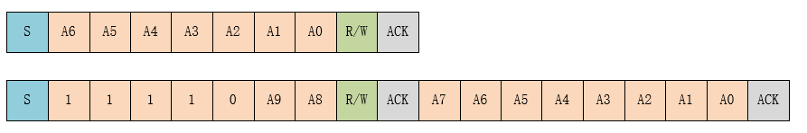

# misaka_device_soft_i2c
御坂网络嵌入式驱动统一软件I2C接口

具体见[御坂网络驱动-软件模拟I2C | xqyjlj](https://xqyjlj.github.io/2021/09/06/御坂网络驱动-软件模拟I2C/)

## I2C 简介

I2C（Inter Integrated Circuit）总线是 PHILIPS 公司开发的一种半双工、双向二线制同步串行总线。I2C 总线传输数据时只需两根信号线，一根是双向数据线 SDA（serial data），另一根是双向时钟线 SCL（serial clock）。SPI 总线有两根线分别用于主从设备之间接收数据和发送数据，而 I2C 总线只使用一根线进行数据收发。

I2C 和 SPI 一样以主从的方式工作，不同于 SPI 一主多从的结构，它允许同时有多个主设备存在，每个连接到总线上的器件都有唯一的地址，主设备启动数据传输并产生时钟信号，从设备被主设备寻址，同一时刻只允许有一个主设备。如下图所示：


如下图所示为 I2C 总线主要的数据传输格式：


当总线空闲时，SDA 和 SCL 都处于高电平状态，当主机要和某个从机通讯时，会先发送一个开始条件，然后发送从机地址和读写控制位，接下来传输数据（主机发送或者接收数据），数据传输结束时主机会发送停止条件。传输的每个字节为8位，高位在前，低位在后。数据传输过程中的不同名词详解如下所示：

- **开始条件：** SCL 为高电平时，主机将 SDA 拉低，表示数据传输即将开始。
- **从机地址：** 主机发送的第一个字节为从机地址，高 7 位为地址，最低位为 R/W 读写控制位，1 表示读操作，0 表示写操作。一般从机地址有 7 位地址模式和 10 位地址模式两种，如果是 10 位地址模式，第一个字节的头 7 位 是 11110XX 的组合，其中最后两位（XX）是 10 位地址的两个最高位，第二个字节为 10 位从机地址的剩下8位，如下图所示：



- **应答信号：** 每传输完成一个字节的数据，接收方就需要回复一个 ACK（acknowledge）。写数据时由从机发送 ACK，读数据时由主机发送 ACK。当主机读到最后一个字节数据时，可发送 NACK（Not acknowledge）然后跟停止条件。

- **数据：** 从机地址发送完后可能会发送一些指令，依从机而定，然后开始传输数据，由主机或者从机发送，每个数据为 8 位，数据的字节数没有限制。

- **重复开始条件：** 在一次通信过程中，主机可能需要和不同的从机传输数据或者需要切换读写操作时，主机可以再发送一个开始条件。

- **停止条件：** 在 SDA 为低电平时，主机将 SCL 拉高并保持高电平，然后在将 SDA 拉高，表示传输结束。

## 访问 I2C 总线设备

  一般情况下 MCU 的 I2C 器件都是作为主机和从机通讯，在 RT-Thread 中将 I2C 主机虚拟为 I2C总线设备，I2C 从机通过 I2C 设备接口和 I2C 总线通讯，相关接口如下所示：

| **函数**                                     | **描述**           |
| -------------------------------------------- | ------------------ |
| misaka_device_soft_i2c_transfer              | 传输数据           |
| misaka_device_soft_i2c_master_send           | 发送数据           |
| misaka_device_soft_i2c_master_recv           | 接收数据           |
| misaka_device_soft_i2c_master_send_then_recv | 发送数据后接收数据 |
| misaka_device_soft_i2c_master_send_then_send | 发送数据后接收数据 |

其中，`misaka_device_soft_i2c_master_send`，`misaka_device_soft_i2c_master_recv`，`misaka_device_soft_i2c_master_send_then_recv`，`misaka_device_soft_i2c_master_send_then_send`都为`misaka_device_soft_i2c_transfer`的再次封装版

## 数据传输

### misaka_device_soft_i2c_transfer

```c
uint16_t misaka_device_soft_i2c_transfer(
    misaka_device_soft_i2c_t ops,
    misaka_device_soft_i2c_message *msgs,
    uint16_t               num);
```

| **参数**           | **描述** |
| ------------------ | -------- |
| ops                | i2c设备  |
| msgs               | 消息对象 |
| num                | 消息数量 |
| **返回**           | ——       |
| 消息数组的元素个数 | ——       |

​	I2C 总线的自定义传输接口传输的数据是以一个消息为单位。参数 *msgs指向待传输的消息数组，用户可以自定义每条消息的内容，实现 I2C 总线所支持的 2 种不同的数据传输模式。如果主设备需要发送重复开始条件，则需要发送 2 个消息。

### misaka_device_soft_i2c_master_send

```c
uint16_t misaka_device_soft_i2c_master_send(
    misaka_device_soft_i2c_t ops, 
    uint16_t addr, 
    uint16_t flags, 
    uint8_t* buf, 
    uint32_t len);
```

| **参数**           | **描述**     |
| ------------------ | ------------ |
| ops                | i2c设备      |
| addr               | 地址         |
| flags              | 标志         |
| buf                | 待发送数据   |
| len                | 发送数据长度 |
| **返回**           | ——           |
| 消息数组的元素个数 | ——           |

​	此函数将长度为`len`的`buf`数据发送到`ops`的`i2c`总线上。

### misaka_device_soft_i2c_master_recv

```c
uint16_t misaka_device_soft_i2c_master_recv(
    misaka_device_soft_i2c_t ops, 
    uint16_t addr,
    uint16_t flags, 
    uint8_t* rxbuf,
    uint32_t rxlen);
```

| **参数**           | **描述**     |
| ------------------ | ------------ |
| ops                | i2c设备      |
| addr               | 地址         |
| flags              | 标志         |
| rxbuf              | 待接收数据   |
| rxlen              | 接收数据长度 |
| **返回**           | ——           |
| 消息数组的元素个数 | ——           |

​	此函数将从`ops`的`i2c`总线上读取长度为`len`的`buf`数据。

### misaka_device_soft_i2c_master_send_then_recv

```c
uint16_t misaka_device_soft_i2c_master_send_then_recv(
    misaka_device_soft_i2c_t ops, 
    uint16_t addr, 
    uint8_t* txbuf, 
    uint32_t txlen,
    uint8_t* rxbuf,
    uint32_t rxlen);
```

| **参数**           | **描述**     |
| ------------------ | ------------ |
| ops                | i2c设备      |
| addr               | 地址         |
| txbuf              | 待发送数据         |
| txlen              | 发送数据长度   |
| rxbuf              | 待接收数据 |
| rxlen              | 接收数据长度             |
| **返回**           | ——           |
| 消息数组的元素个数 | ——           |

​	此函数线将长度为`txlen`的`txbuf`数据发送到`ops`的`i2c`总线上，之后再读取长度为`rxlen`的`rxbuf`。	

### misaka_device_soft_i2c_master_send_then_send

```c
uint16_t misaka_device_soft_i2c_master_send_then_send(
    misaka_device_soft_i2c_t ops, 
    uint16_t addr, 
    uint8_t* txbuf1, 
    uint32_t txlen1, 
    uint8_t* txbuf2, 
    uint32_t txlen2);
```


| **参数**           | **描述**     |
| ------------------ | ------------ |
| ops                | i2c设备      |
| addr               | 地址         |
| txbuf1             | 待发送数据1         |
| txlen1             | 发送数据长度1   |
| txbuf2       | 待发送数据2 |
| txlen2 | 发送数据长度2             |
| **返回**           | ——           |
| 消息数组的元素个数 | ——           |

​	此函数线将长度为`txlen1`的`txbuf1`数据发送到`ops`的`i2c`总线上，之后再发送长度为`txlen2`的`txbuf2`。	

> [!NOTE] 注：以上函数会调用 mutex_take，如果设置了的话

## 数据结构

I2C 消息数据结构原型如下：

```c
/* the message of i2c device */
typedef struct
{
    uint16_t addr; //从机地址
    uint16_t flags; //读、写标志等
    uint32_t len; //读写数据字节数
    uint8_t* buf; //读写数据缓冲区指针
} misaka_device_soft_i2c_message, *misaka_device_soft_i2c_message_t;
```

标志 flags 可取值为以下宏定义，根据需要可以与其他宏使用位运算 “|” 组合起来使用。

```c
/*i2c bus operate flag*/
#define misaka_device_soft_i2c_WR            0x0000     //写标志位
#define misaka_device_soft_i2c_RD            (1u << 0)  //读标志位
#define misaka_device_soft_i2c_ADDR_10BIT    (1u << 2)  //10位地址
#define misaka_device_soft_i2c_NO_START      (1u << 4)  //无Start信号
#define misaka_device_soft_i2c_IGNORE_NACK   (1u << 5)  //忽略Nack
#define misaka_device_soft_i2c_NO_READ_ACK   (1u << 6)  //当i2c读取时，不产生Ack
```

## 回调函数

### misaka_device_soft_i2c_error_callback

```C
void misaka_device_soft_i2c_error_callback(misaka_device_soft_i2c_t ops)
```

| **参数** | **描述** |
| -------- | -------- |
| ops      | i2c设备  |

​	此函数会在I2C读写错误时调用。

## 移植说明

移植时只需补充驱动框架所需要的函数和参数即可（仅需一个文件）

```c
typedef struct
{
    void (*set_sda)(uint8_t state); //设置sda引脚电平

    void (*set_scl)(uint8_t state); //设置scl引脚电平

    uint8_t (*get_sda)(void); //读取sda引脚电平

    void (*delay_us)(uint16_t us); //延时us

    void (*set_sda_out)(); //设置sda引脚为输出模式（硬件无上拉时需要添加）

    void (*set_sda_in)(); //设置sda引脚为输入模式（硬件无上拉时需要添加）

    void (*mutex_take)(); //获取互斥量，如果为裸机系统，空函数即可

    void (*mutex_release)(); //释放互斥量，如果为裸机系统，空函数即可

    uint16_t us; //us延时单位，决定了此模拟iic的速率
} misaka_device_soft_i2c, *misaka_device_soft_i2c_t;

/**
 * @brief I2C读写错误回调函数
 * @param  ops              i2c设备
 */
void misaka_device_soft_i2c_error_callback(misaka_device_soft_i2c_t ops);
```

### 示例

```c
#include "misaka_device_soft_i2c.h"

static misaka_device_soft_i2c i2c_obj;

/**
 * @brief 设置sda引脚电平
 * @param  level            0: 低电平
 *                          1: 高电平
 */
static void set_sda(uint8_t level)
{

}

/**
 * @brief 设置scl引脚电平
 * @param  level            0: 低电平
 *                          1: 高电平
 */
static void set_scl(uint8_t level)
{

}

/**
 * @brief 读取sda引脚电平
 * @return 0 @c 低电平
 * @return 1 @c 高电平
 */
static uint8_t get_sda()
{

}

/**
 * @brief 获取互斥量，如果为裸机系统，空函数即可
 */
static void mutex_take()
{

}

/**
 * @brief 释放互斥量，如果为裸机系统，空函数即可
 */
static void mutex_release()
{

}

/**
 * @brief 延时us
 * @param  ms               desc
 */
static void delay_us(uint16_t ms)
{

}

/**
 * @brief 设置sda引脚为输出模式（硬件无上拉时需要添加）
 */
static void set_sda_out()
{

}

/**
 * @brief 设置sda引脚为输入模式（硬件无上拉时需要添加）
 */
static void set_sda_in()
{

}

/**
 * @brief I2C读写错误回调函数
 * @param  ops              i2c设备
 */
void misaka_device_soft_i2c_error_callback(misaka_device_soft_i2c_t ops)
{

}

misaka_device_soft_i2c_t misaka_device_soft_i2c_port_init()
{
    i2c_obj.delay_us = delay_us;
    i2c_obj.get_sda = get_sda;
    i2c_obj.mutex_release = mutex_release;
    i2c_obj.mutex_take = mutex_take;
    i2c_obj.set_scl = set_scl;
    i2c_obj.set_sda = set_sda;
    i2c_obj.set_sda_out = set_sda_out;
    i2c_obj.set_sda_in = set_sda_in;
    i2c_obj.us = 1;

    set_sda(1);
    set_scl(1);

    misaka_device_soft_i2c_init(&i2c_obj);

    return &i2c_obj;
}
```

之后调用 `misaka_device_soft_i2c_port_init`进行初始化即可。

# 参考

[RT-Thread/rt-thread: RT-Thread is an open source IoT operating system. (github.com)](https://github.com/RT-Thread/rt-thread)

[docs-online: RT-Thread在线文档中心 (gitee.com)](https://gitee.com/rtthread/docs-online)

[RT-Thread/rtthread-manual-doc: RT-Thread Programming Manual in English (github.com)](https://github.com/RT-Thread/rtthread-manual-doc)

